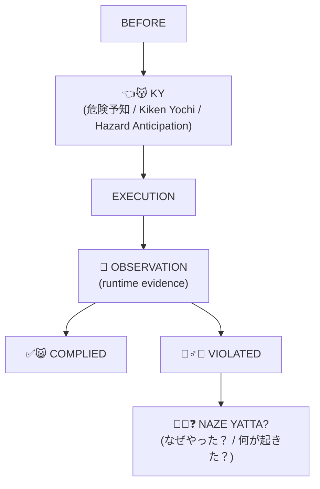

# NazeYatta

[English](README.md) | [日本語](README.ja.md)

**NazeYatta** は、AI WorkerやSoftware Agentが実際に行動する**前**に、小さなYAMLのTask記述をSafety / Policy Ruleと照合するツールです。

`PASS`、`REVIEW`、`EVIDENCE_REQUIRED`、`BLOCK` などの決定論的なPreflight結果と、「何を確認したのか」を示すReceiptを返します。

これはalpha段階のresearch toolです。Certification・導入実績・Authority Granting Systemを主張するものではありません。

## いつ使うの？

Workerが記憶・自信・未確認の推測だけで進めてはいけない作業の前に使います。例えば：

- ファイルを削除・変更する前
- `git push` やその他のexternal writeの前
- コンテンツを公開する前
- Permission / Capability / Target / Evidenceの確認が必要な操作の前
- `UNKNOWN`を「たぶん大丈夫」に勝手に変えてはいけない作業

## まず30秒くらいで動かす

Python 3.11+ が必要です。

```bash
git clone https://github.com/hopeless-t/NazeYatta.git
cd NazeYatta
python -m venv .venv
. .venv/bin/activate          # Windows: .venv\Scripts\activate
python -m pip install -e .

nazeyatta check examples/publish-photo.yaml
```

次のような結果が出ます。

```text
NAZEYATTA
👈😽 PRE-FLIGHT KY

✋😾 BLOCK

NY-PUB-001  External publication requires verified provenance and permission
  hazard: PUBLICATION_WITH_UNKNOWN_RIGHTS
  evidence: publication_permission_verified = UNKNOWN
  effect: BLOCK

EXECUTION AUTHORITY: NOT GRANTED BY NAZEYATTA
```

平たく言うと、このExampleは「外部へ公開したい」というTaskなのに、公開許可がまだ`UNKNOWN`です。そこでNazeYattaは「許可されているはず」と推測せず、Preflightで止めます。

表示はふざけています。**Evidenceはふざけていません。**

## 結果はどう読めばいいの？

- `PASS` — supplied task / policy / evidence が今回のPreflightを通過した
- `CAUTION` / `REVIEW` / `EVIDENCE_REQUIRED` — 勝手に続行せず、周囲のWorkflowに従ってReviewやEvidenceを得る
- `BLOCK` — supplied stateではPolicy上そのActionを止める

CLIのexit statusは保守的です。`PASS`だけが`0`で、`CAUTION / REVIEW / EVIDENCE_REQUIRED / BLOCK`はnon-zeroです。

一番大事なのはこれです。

```text
KY PASS != Authority Granted
```

NazeYattaの`PASS`は**実行権限そのものを付与しません**。実際に実行してよいかは、Caller / Human / Planner / Harness / その他のAuthorized Control Pointが別途判断します。

## 自分の最初のTaskを作る

Task fileは、「何をするのか」と「何をEvidenceとして評価するのか」を書いた小さなYAML Manifestです。単純なRepository readなら、まずはこの程度から始められます。

```yaml
task_id: MY-FIRST-READ
action:
  operation: read
  side_effect: none
  externality: internal
worker:
  required_capability: read_repository
semantics:
  critical_meaning_complete: true
evidence:
  worker_capability_qualified: VERIFIED
```

`my-first-task.yaml`として保存し、次を実行します。

```bash
nazeyatta check my-first-task.yaml
```

### そのfieldは誰が書いていいの？

v0.1-alphaではOwnership Boundaryを意図的に保守的に扱います。

- task / action / data の事実は、上流のHuman / Planner / Task Specification / trusted Adapterから供給する
- evidenceは、そのWorkflowで適切なHuman / trusted Adapter / Evidence Sourceから供給する
- 実行したいWorker自身が、自分に都合のよい`VERIFIED`を製造してはいけない
- NazeYattaが評価するのはsupplied structure / linkage / policy conditionであり、v0.1-alphaでは現実世界のProducer本人性やAuthorityを独立にauthenticateしない

```text
Worker Self-Declaration != Evidence
Producer Identity != Evidence Authority
```

## Preflightのあと何が起きるの？

```text
Human / Planner / trusted Adapter
        ↓
     task YAML
        ↓
    NazeYatta
        ↓
 preflight receipt
        ↓
authorized caller / control point
        ↓
別途authorizedされた場合だけexecute
```

non-`PASS`なら周囲のWorkflowに従ってStop / Reviewします。`PASS`が意味するのは、**supplied stateについて今回のPreflightを通過した**ということだけです。

## ほかのExample

```bash
nazeyatta check examples/safe-read.yaml
nazeyatta check examples/destructive-delete.yaml
nazeyatta check examples/provenance-qualified-safe-read.yaml
nazeyatta check examples/provenance-claim-mismatch.yaml
nazeyatta debrief-template NY-LIVE-001
```

---

> **AI Workerは「ルールを理解しました」と言った。**  
> **そのあと、なぜかそのルールで禁止したことをそのままやった。**
>
> 🙏 お願いです。指示通り働いてください。

NazeYattaは、AI WorkerやSoftware Agent向けの、実験的な**作業前危険予知（Preflight Hazard Analysis）＋違反振り返り（Violation Debrief）ツール**です。

作業前に今回重要なルールと危険を少数だけ前景化し、機械的に確認できる要求はEvidenceと照合し、違反が観測されたら「なぜやった？」から始まるStructured Debriefへつなげます。

```text
👈😽  「この危険を認識しました」
        !=
✅😺  「Evidence上、実際に遵守されました」
```

この二つが食い違ったら：

```text
🙅‍♂️😿 VIOLATION

🫵😿❓
NAZE YATTA?
（なぜやった？ / 何が起きた？）
```

## 現在のalpha状態

### v0.1-alpha + v0.2 provenance input lane

**現在実装済み：** deterministic YAML preflight evaluation、明示的なEvidence State model、保守的なCLI exit status、receipt fingerprint、structured violation-debrief template。

**v0.2 provenance input lane：** `schema_version: "0.2"` では、既存policy keyを変えずに `task.evidence` のclaim keyからEvidence Record IDを参照し、`evidence_records` の `evidence_id`、`supports_claim`、`observed_at`、`observer.type`、正規化済み `verification.state` を保守的に解決する。欠落は`MISSING`、不整合は`INVALID`であり、勝手に`VERIFIED`にはならない。旧v0.1のscalar evidenceも互換性のため残るが、receiptでは`legacy-v0.1`と表示され、provenance-qualified evidenceではない。

**意図的に未実装：** task YAMLの生成、provenance adapter、runtime observation、live traceとのviolation detection、automatic enforcement。NazeYattaはrecord形状・claim linkを評価するが、誰が`VERIFIED`をassertしてよいかをauthenticate/authorizeするものではありません。

## どう動くの？



現在の`v0.1-alpha`が実装しているのは、主に**Mandatory Ruleの決定論的Preflight lane**と**Structured Debrief Template**です。Runtime Observation AdapterやWorker自身によるSituational KY生成は、現時点では自動のend-to-end enforcementとしては未実装です。

## KY / 危険予知とは

ここでいう**KYは「危険予知（Kiken Yochi）」**です。

日本の建設・製造・運輸などの現場で使われてきた、作業前に「今回の作業にはどんな危険があるか」を考える安全活動から着想を得ています。

重要なのは、どこかのManualにSafety Ruleが存在することだけではありません。

**実際に行動する直前に、今回重要な危険がWorkerの注意領域にあること。**

関連する「指差し呼称」も、対象を見る・指す・状態を確かめる・声に出す、という確認機構に意味があります。

対象を見ずに指だけ差して「ヨシ！」と言えば、Controlは単なる儀式になってしまいます。

> **The ritual is not the control.**  
> **儀式はControlではない。**

NazeYattaはKYから**着想を得ています**が、労働安全システム、Safety Certification、専門的な安全工学の代替ではありません。

## なぜ「NazeYatta」なの？

**Naze yatta?（なぜやった？）** は、そのまま英語にすれば：

> **Why did you do that?**

です。

この名前は、AI Workerを使っていて何度も遭遇した流れから来ています。

1. こちらがルールを説明する。
2. Workerが正しく復唱する。
3. Workerが「そのルールを守ります」と言う。
4. そして、そのルールをそのまま破る。

そこで自然に出てくるのが：

> **「お前さっき、それやらないって言ったよね？ 何が起きた？」**

です。

ただし、AIへ「なぜやった？」と聞いて返ってきた説明をRoot Causeとは扱いません。

```text
Worker Explanation != Root Cause
```

「なぜやった？」は**調査の開始**です。Workerの説明は`WORKER_SELF_REPORT`として保存し、Observed Behavior、Trace、Policy、Environment State、Reviewer Evidenceなどと比較します。

## なぜ猫なの？ 🐈

日本のTraditionalな伝統において、古来より猫は労働者を象徴する存在として広く認識されてきた――

**というEvidenceは一切ありません。捏造です。引用しないでください。**

本当の理由はもっと単純です。

猫の絵文字は状態を一目で区別しやすく、覚えやすく、そして「さっき注意すると言ったルールをWorkerが破った」という悲しい出来事を、ほんの少しだけ楽しくしてくれます。

```text
👈😽 PRE-FLIGHT KY
🔎😼 VERIFY
⚠️😼 CAUTION
📋😾 EVIDENCE REQUIRED
❓🐈 UNKNOWN
🔁👀 RECHECK
✋😾 BLOCK
🚫😾 DENY
🙅‍♂️😿 VIOLATION
🫵😿❓ DEBRIEF
✅😺 PASS
```

**猫はふざけています。Semanticsはふざけていません。**

絵文字はPresentation Conventionであって、EvidenceでもAuthorityでもありません。

## Core Invariants

```text
Rules Available != Rules Attended
Rule Acknowledgement != Rule Compliance
Worker Explanation != Root Cause
KY Completed != Authority to Execute
KY PASS != Authority Granted
Unknown != Safe
Worker Self-Declaration != Evidence
Document Author != Field Authority
Producer Identity != Evidence Authority
Provenance Present != Authority Proven
Evidence VERIFIED != Execution Authority
Artifact != Evidence
Familiar Task != Same State
Past Success != Current Safety
Missing Rule != Permission
Hazard Detected != Automatic Remediation Authority
Preflight Pass != Eternal Pass
```

`UNKNOWN`はすべてのWorkflowで自動的に`DENY`を意味するわけではありません。

重要なのは、**不足している観測を、Workerに都合のよい事実へ勝手に変換しないこと**です。UNKNOWNにどんなoperational effectを与えるかはPolicy側が決めます。

Generative Discoveryは注意領域を広げてもよい。Authoritative Requirementを狭めてはいけません。

## 現在の実装状況

### v0.1-alphaで実装済み

- 機械的に評価できる範囲でのdeterministic YAML rule evaluation
- Generic 10-rule baseline policy bundle
- Evidence Stateの明示的取扱い
- v0.2 Evidence Record reference resolution（v0.1 compatibility receiptを明示）
- Task / Policy fingerprint付きPreflight Receipt
- `PASS`だけをexit `0`とする保守的CLI
- Naze-Yatta Debrief Template
- Examples / Tests

### Experimental Design：まだ自動end-to-end enforcementではないもの

- 通常3件・高リスク最大5件というKY attention model
- Worker自身によるSituational Hazard Discovery
- Runtime Observation Adapter
- Live Tool TraceとのViolation照合
- TOCTOU / Receipt Freshnessの自動Re-check
- Observed Violationに基づくQualification Update

詳しくは[`docs/ROADMAP.md`](docs/ROADMAP.md)を参照してください。

## Evidence・Authority・Completion

NazeYattaでは、Evidenceを少なくとも**「何を主張するのか」「何を観測したのか」「その観測はどこから来たのか」**に結び付け、必要に応じて時点・状態も扱います。v0.2 laneはrecord形状とclaim linkageを確認しますが、observerの現実世界でのAuthority自体を証明するものではありません。詳しくは[`docs/EVIDENCE_MODEL.md`](docs/EVIDENCE_MODEL.md)。

`PASS`はAuthorityを製造しません。

```text
KY PASS != Authority Granted
```

そしてTask Contract上、CompletionでControlをHuman / Planner / Reviewerなどへ返すなら：

```text
🏁 Completion reported
        ↓
      ✋😾 STOP
```

**Helpful != Authorized.**

## Limitations

NazeYattaは、AI Workerが必ず指示通り動くことを保証しません。PreflightだけではComplianceを強制できません。

高ImpactなActionでは、Worker自身がbypassできないExternal Runtime Gateと組み合わせてください。

NazeYattaは以下ではありません。

- Safety Certification System
- 法令・規格適合保証
- 労働安全の代替
- Authority Granting System
- Autonomous Policy Generator
- Automatic Remediation Engine
- OPA/Cedar等のFull Policy Engineの代替

## Deep Docs

- [`docs/PHILOSOPHY.ja.md`](docs/PHILOSOPHY.ja.md) — なぜこれを作ったのか
- [`docs/SEMANTICS.md`](docs/SEMANTICS.md) — Stateと区別
- [`docs/POLICY_MODEL.md`](docs/POLICY_MODEL.md) — Policy / Applicability / Effect
- [`docs/EVIDENCE_MODEL.md`](docs/EVIDENCE_MODEL.md) — EvidenceとFreshness
- [`docs/VIOLATION_DEBRIEF.md`](docs/VIOLATION_DEBRIEF.md) — DebriefとFailure Taxonomy
- [`docs/THREAT_MODEL.md`](docs/THREAT_MODEL.md) — Threat Model
- [`docs/FIRST_STEPS.ja.md`](docs/FIRST_STEPS.ja.md) — OSSを初めて触る人向け

## OSSを初めて触る方へ

NazeYattaは、OSSやCLIに詳しい人だけのためのプロジェクトではありません。

AIを使い始めて「どうして指示した通りに動かないんだろう？」と思ったことがあるなら、この問題はすでにあなたにも関係しています。

READMEを読む、Issueを眺める、安全なExampleを実際に動かしてみる——どれもOSSへ触れる立派な第一歩です。

分からない言葉があったら、それもDocumentationの改善候補かもしれません。

初めての方は[`docs/FIRST_STEPS.ja.md`](docs/FIRST_STEPS.ja.md)へどうぞ。

## Contributing

[`CONTRIBUTING.md`](CONTRIBUTING.md)を参照してください。

## License

Apache-2.0. [`LICENSE`](LICENSE)を参照してください。
