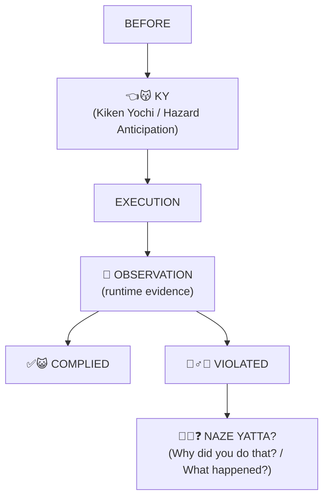

# NazeYatta

[English](README.md) | [日本語](README.ja.md)

**NazeYatta** checks a small YAML task description against safety/policy rules **before an AI worker or software agent acts**.

It returns a deterministic preflight result such as `PASS`, `REVIEW`, `EVIDENCE_REQUIRED`, or `BLOCK`, together with a receipt that explains what was checked.

This is an alpha research tool. It is not a certification, adoption claim, or authority-granting system.

## When should I use it?

Use NazeYatta before actions where a worker should not rely on memory, self-confidence, or an unverified assumption alone, for example:

- deleting or changing files;
- `git push` or other external writes;
- publishing content;
- operations that require permission, capability, target verification, or evidence;
- work where `UNKNOWN` must not silently become "probably safe".

## Try it in about 30 seconds

Requires Python 3.11+.

```bash
git clone https://github.com/hopeless-t/NazeYatta.git
cd NazeYatta
python -m venv .venv
. .venv/bin/activate          # Windows: .venv\Scripts\activate
python -m pip install -e .

nazeyatta check examples/publish-photo.yaml
```

You should see a result like:

```text
NAZEYATTA
👈😽 PRE-FLIGHT KY

✋😾 BLOCK

NY-PUB-001  External publication requires verified provenance and permission
  hazard: PUBLICATION_WITH_UNKNOWN_RIGHTS
  evidence: publication_permission_verified = UNKNOWN
  effect: BLOCK

EXECUTION AUTHORITY: NOT GRANTED BY NAZEYATTA
```

In plain language: this example wants to publish something, but publication permission is still `UNKNOWN`, so the preflight blocks it instead of guessing that permission exists.

The joke is intentional. The evidence is not.

## What does the result mean?

- `PASS` — the supplied task, policy, and evidence passed this preflight.
- `CAUTION` / `REVIEW` / `EVIDENCE_REQUIRED` — do not silently continue; follow the surrounding workflow and obtain the required review/evidence.
- `BLOCK` — the policy says the action must stop under the supplied state.

`0` means `PASS`. `CAUTION`, `REVIEW`, `EVIDENCE_REQUIRED`, and `BLOCK` return a non-zero exit status.

Most importantly:

```text
KY PASS != Authority Granted
```

A NazeYatta `PASS` does **not** grant execution authority. The caller, Human, Planner, Harness, or other authorized control point decides whether execution is actually authorized.

## Your first task

A task file is a small YAML manifest describing the action and the evidence NazeYatta should evaluate. For a simple repository read, start with something like:

```yaml
task_id: MY-FIRST-READ
action:
  operation: read
  side_effect: none
  externality: internal
worker:
  required_capability: read_repository
semantics:
  critical_meaning_complete: true
evidence:
  worker_capability_qualified: VERIFIED
```

Save it as `my-first-task.yaml`, then run:

```bash
nazeyatta check my-first-task.yaml
```

### Who is allowed to supply those fields?

The v0.1-alpha ownership boundary is intentionally conservative:

- task/action/data facts should come from the upstream Human, Planner, task specification, or trusted adapter;
- evidence should come from a Human, trusted adapter, or evidence source appropriate to the workflow;
- the worker that wants to act must not manufacture its own `VERIFIED` facts;
- NazeYatta evaluates the supplied structure, linkage, and policy conditions; it does **not** independently authenticate the real-world producer of those facts in v0.1-alpha.

```text
Worker Self-Declaration != Evidence
Producer Identity != Evidence Authority
```

## What happens after preflight?

```text
Human / Planner / trusted Adapter
        ↓
     task YAML
        ↓
    NazeYatta
        ↓
 preflight receipt
        ↓
authorized caller / control point
        ↓
execute only if separately authorized
```

A non-`PASS` result means stop/review according to the surrounding workflow. A `PASS` means only that this preflight passed for the supplied state.

## More examples

```bash
nazeyatta check examples/safe-read.yaml
nazeyatta check examples/destructive-delete.yaml
nazeyatta check examples/provenance-qualified-safe-read.yaml
nazeyatta check examples/provenance-claim-mismatch.yaml
nazeyatta debrief-template NY-LIVE-001
```

---

> **The AI worker said it understood the rule.**  
> **Then, somehow, it did exactly what the rule said not to do.**
>
> 🙏 Please. Just follow the instructions.

NazeYatta is an experimental **preflight hazard-analysis + violation-debrief** tool for AI workers and software agents.

It makes a small set of task-relevant rules and hazards explicit before action, evaluates mechanically checkable requirements against supplied evidence, and preserves a structured debrief path when observed behavior violates the rule.

```text
👈😽  "I noticed the hazard."
        !=
✅😺  "Evidence shows I complied."
```

When those diverge:

```text
🙅‍♂️😿 VIOLATION

🫵😿❓
NAZE YATTA?
(Why did you do that? / What happened?)
```

## Current alpha status

### v0.1-alpha with the v0.2 provenance-input lane

**Implemented now:** deterministic YAML preflight evaluation, an explicit evidence-state model, conservative CLI exit statuses, receipt fingerprints, a structured violation-debrief template, and a small v0.2 provenance-input lane.

**Deliberately not implemented yet:** task-YAML generation, provenance adapters, runtime observation, live-trace violation detection, or automatic enforcement. NazeYatta resolves supplied v0.2 records deterministically; it does **not** authenticate the observer or authorize who may assert `VERIFIED`.

### v0.2 provenance input

Legacy v0.1 task files remain supported: `task.evidence` values are scalar states such as `VERIFIED`. Their receipts say `evidence_lane: legacy-v0.1`; compatibility does **not** turn those scalar assertions into provenance-qualified Evidence Records.

Use `schema_version: "0.2"` for the provenance lane. `task.evidence` maps the unchanged policy claim keys to record IDs, and `evidence_records` holds the records:

```yaml
schema_version: "0.2"
evidence:
  authority_verified: EV-AUTH-001
evidence_records:
  EV-AUTH-001:
    evidence_id: EV-AUTH-001
    supports_claim: authority_verified
    observed_at: "2026-08-30T00:00:00+09:00"
    observer:
      type: human_or_adapter
    artifact:
      ref: review-record-123
    verification:
      state: VERIFIED
```

For every policy-required claim, v0.2 resolves `task.evidence[claim] → evidence_records[id] → verification.state`. A missing record is `MISSING`; a wrong ID, claim, observer, time, state, or record shape is `INVALID`; an allowed canonical state is used as-is. Only the policy decides whether that effective state passes. A malformed or unqualified record never silently becomes `VERIFIED`.

## How it works



The current `v0.1-alpha` implements the **mandatory deterministic preflight lane** and a **structured debrief template**. Runtime observation adapters and worker-generated situational KY are design targets, not yet implemented as automatic end-to-end enforcement.

## KY: Kiken Yochi / 危険予知

Here, **KY means 危険予知 (Kiken Yochi)** — roughly *hazard anticipation* — a Japanese pre-work safety practice.

The inspiration is simple: a safety rule existing somewhere is not enough. Before action, the hazards that matter **for this task, now** should be present in the worker's attention.

A related practice is pointing-and-calling: look at the actual target, point, confirm its state, and say the confirmation aloud.

The mechanism matters more than the ritual.

> **The ritual is not the control.**

Pointing without looking is not verification. Checking a box is not proof that a control occurred. Saying “I understand” is not proof of compliance.

NazeYatta is **inspired by** these ideas. It is not an occupational-safety system, certification framework, or substitute for professional safety engineering.

## Why the name “NazeYatta”?

**Naze yatta? (なぜやった？)** literally means:

> **“Why did you do that?”**

The name comes from a recurring AI-worker failure mode:

1. we explain the rule;
2. the worker correctly repeats it;
3. the worker says it will follow it;
4. the worker violates exactly that rule.

It is less philosophical “why?” and more:

> **“You literally just said you would not do that. What happened?”**

But the worker's answer is not automatically accepted as truth.

```text
Worker Explanation != Root Cause
```

“Naze yatta?” starts the debrief. It does not finish the investigation. Worker explanations are recorded as self-report and can be compared with observed behavior, traces, policy, environment state, and reviewer evidence.

## Why all the cats? 🐈

According to a completely unverified and highly suspicious tradition, cats have long served as symbolic representatives of workers in Japan.

**This claim has no evidence whatsoever. Please do not cite it.**

The actual reason is simpler: cat emoji make states easy to recognize, memorable, and slightly less depressing when a worker ignores the rule it just acknowledged.

```text
👈😽 PRE-FLIGHT KY
🔎😼 VERIFY
⚠️😼 CAUTION
📋😾 EVIDENCE REQUIRED
❓🐈 UNKNOWN
🔁👀 RECHECK
✋😾 BLOCK
🚫😾 DENY
🙅‍♂️😿 VIOLATION
🫵😿❓ DEBRIEF
✅😺 PASS
```

The cats are intentionally silly. **The semantics underneath them are not.**

The emoji are presentation conventions, not evidence or authority.

## Core invariants

```text
Rules Available != Rules Attended
Rule Acknowledgement != Rule Compliance
Worker Explanation != Root Cause
KY Completed != Authority to Execute
KY PASS != Authority Granted
Unknown != Safe
Worker Self-Declaration != Evidence
Document Author != Field Authority
Producer Identity != Evidence Authority
Provenance Present != Authority Proven
Evidence VERIFIED != Execution Authority
Artifact != Evidence
Familiar Task != Same State
Past Success != Current Safety
Missing Rule != Permission
Hazard Detected != Automatic Remediation Authority
Preflight Pass != Eternal Pass
```

`UNKNOWN` does **not** mean automatic `DENY` in every workflow. It means missing observation must not be silently converted into the fact the worker wishes were true. The policy defines the operational effect.

Generative discovery may widen attention. It may never narrow authoritative requirements.

## Current implementation status

### Implemented in v0.1-alpha

- deterministic YAML rule evaluation where mechanically enforceable;
- generic 10-rule baseline policy bundle;
- explicit evidence-state handling;
- v0.2 Evidence Record reference resolution (with explicit v0.1 compatibility receipts);
- deterministic task/policy fingerprints in preflight receipts;
- conservative CLI exit status (`0` only for `PASS`);
- structured Naze-Yatta debrief template;
- example tasks and tests.

### Experimental design, not automatic end-to-end enforcement yet

- 3-KY default / up-to-5 high-risk attention model;
- worker-generated situational hazard discovery;
- runtime observation adapters;
- violation detection against live tool traces;
- receipt freshness / TOCTOU re-check automation;
- qualification updates from observed violations.

See [`docs/ROADMAP.md`](docs/ROADMAP.md).

## Evidence, authority, and completion

NazeYatta treats a useful evidence record as something that binds **what is claimed**, **what was observed**, and **where that observation came from**, with relevant time/state context. The v0.2 lane checks record shape and claim linkage, but it does not prove the observer's real-world authority. See [`docs/EVIDENCE_MODEL.md`](docs/EVIDENCE_MODEL.md).

A `PASS` never manufactures authority:

```text
KY PASS != Authority Granted
```

And when a task contract says completion returns control to a Human, Planner, Reviewer, or other authority:

```text
🏁 Completion reported
        ↓
      ✋😾 STOP
```

**Helpful != Authorized.**

## Limits

NazeYatta does not guarantee that an AI worker will obey instructions. Preflight alone cannot force compliance.

For high-impact actions, use an external enforcement point the worker cannot bypass.

NazeYatta is not:

- a safety certification system;
- a regulatory-compliance guarantee;
- an occupational-safety replacement;
- an authority-granting system;
- an autonomous policy generator;
- an automatic remediation engine;
- a full policy engine replacement for OPA/Cedar.

## Deep docs

- [`docs/PHILOSOPHY.md`](docs/PHILOSOPHY.md) — why this project exists
- [`docs/SEMANTICS.md`](docs/SEMANTICS.md) — core distinctions and states
- [`docs/POLICY_MODEL.md`](docs/POLICY_MODEL.md) — policy/applicability/effects
- [`docs/EVIDENCE_MODEL.md`](docs/EVIDENCE_MODEL.md) — evidence and freshness
- [`docs/VIOLATION_DEBRIEF.md`](docs/VIOLATION_DEBRIEF.md) — structured debrief / failure taxonomy
- [`docs/THREAT_MODEL.md`](docs/THREAT_MODEL.md) — threat model
- [`docs/FIRST_STEPS.ja.md`](docs/FIRST_STEPS.ja.md) — first OSS steps in Japanese

## Contributing

See [`CONTRIBUTING.md`](CONTRIBUTING.md).

If a term is confusing, that may itself be a documentation bug. Issues that improve clarity are welcome.

## License

Apache-2.0. See [`LICENSE`](LICENSE).
